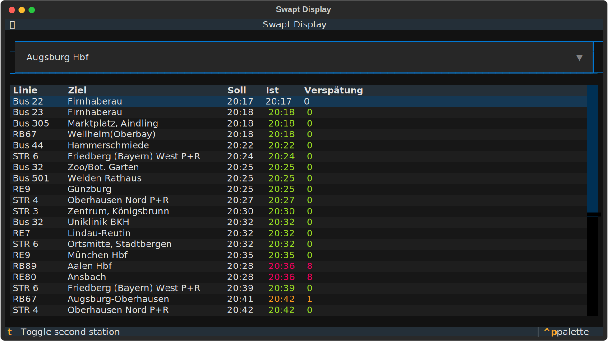
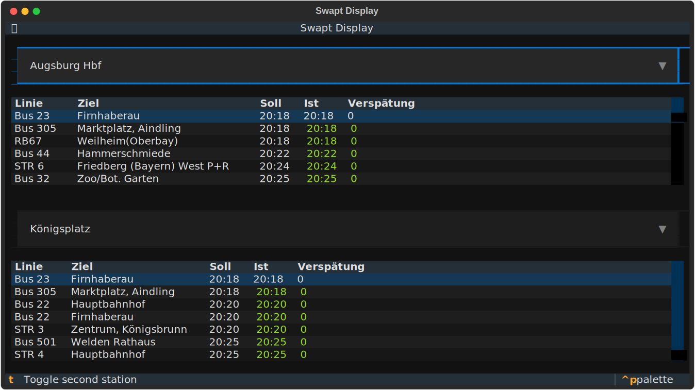

# SwaptDisplay

Terminal-based departure board for public transit, built with [Textual](https://textual.textualize.io/).
Uses the [v6.db.transport.rest](https://v6.db.transport.rest/getting-started.html) API for real-time departure data.

<p>
  
  
</p>

## Installation

Requires Python 3.14+.

```sh
uv sync
```

## Usage

```sh
uv run swaptdisplay
# or
uv run python -m swaptdisplay
```

### CLI Options

| Flag                   | Description                                                |
| ---------------------- | ---------------------------------------------------------- |
| `-s`, `--station`      | Station name (default: `Augsburg Hbf`)                     |
| `-i`, `--station-id`   | Station ID (alternative to name)                           |
| `-s2`, `--station2`    | Second station name for dual mode (default: `Königsplatz`) |
| `-i2`, `--station2-id` | Second station ID (alternative to name)                    |
| `-d`, `--dual`         | Start with both station panels visible                     |

Press `t` to toggle the second station panel at runtime.

## Adapting to Other Cities or Regions

This project uses the [FPTF](https://github.com/public-transport/friendly-public-transport-format)-compatible API ecosystem.

To switch to a different city or region:

1. **Replace `stations.txt`** — this file lists stations in `name; id` format. Query available stops via the `/locations` endpoint (replace `CITY` with your city or region):
   ```sh
   curl -s 'https://v6.db.transport.rest/locations?query=CITY&results=500&addresses=false&poi=false' \
     | jq -r '.[] | "\(.name); \(.id)"'
   ```
2. **Adjust direction suffixes** in `api.py` — the `extract_departures()` function strips a region-specific suffix (`", Augsburg (Bayern)"`) from direction names. Update or remove this to match your city or region.
3. **Adjust default stations** in `main.py`.

## License

[GPLv3](LICENSE)
